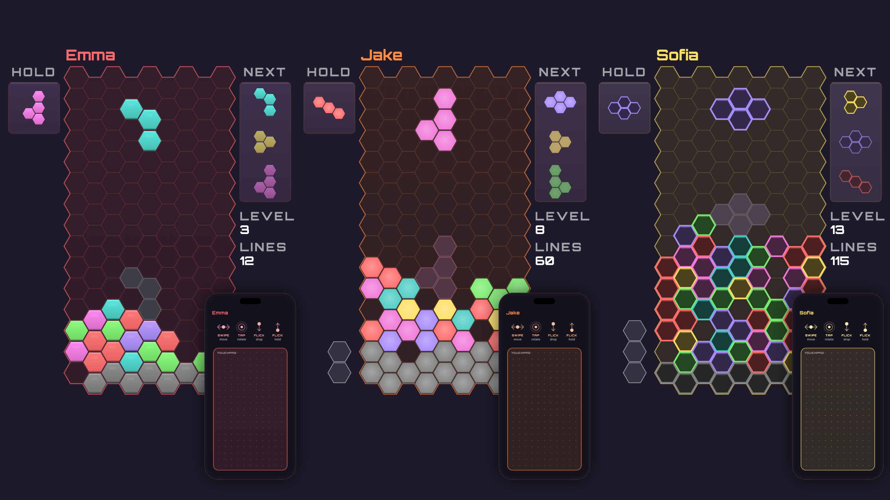
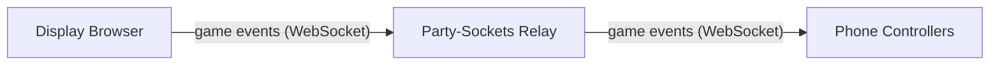
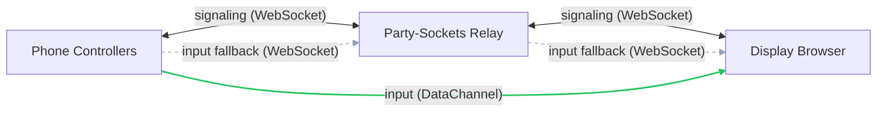

# HexStacker Party



Multiplayer hex stacker where phones become controllers and a shared screen shows the action.

**Play now at [hexstacker.com](https://hexstacker.com)**

**Gallery**: [main.hexstacker.com/gallery.html](https://main.hexstacker.com/gallery.html) — reference pages for the display, the phone, and piece rotations · cross-platform comparison (web vs tvOS vs Android TV): [main.hexstacker.com/tv-gallery/](https://main.hexstacker.com/tv-gallery/)

## Overview

HexStacker Party supports 1 to 8 players on a single shared display. One browser window acts as the game screen (TV, monitor, or laptop), while each player joins by scanning a QR code with their phone. The display runs the authoritative game engine; the Node.js server only serves static files and a QR code API.

## Architecture

**Game events** — display broadcasts state to all controllers via the relay.



**Controller input** — after WebRTC negotiation, input goes directly to the display over a DataChannel; the relay serves as signaling channel and input fallback.



## Features

- 1–8 players on one shared screen
- QR code join – scan and play, no app install
- Touch gesture controls with haptic feedback (Android)
- Hexagonal grid with line clears and garbage attack
- Per-player level selection (1–15) and color picker in lobby
- Controller settings: audio, haptics, touch sensitivity
- Localized UI (11 languages)
- AirConsole platform support

## Quick Start

```bash
npm install
node server/index.js          # dev: serves individual scripts, no build needed
```

For a production-style run, build the bundles first and start in production mode:

```bash
npm run build                 # esbuild: one hashed bundle per app + dist/partycore.js
APP_ENV=production node server/index.js
```

1. Open `http://localhost:4000` on a big screen.
2. Players scan the QR code with their phones to join.
3. The first player to join is the host and starts the game.
4. Use touch gestures on your phone to control pieces. Last player standing wins.

## Controller Gestures

| Gesture | Action |
|---|---|
| Drag left/right | Move piece horizontally (ratcheting at 44 px steps) |
| Tap | Rotate clockwise |
| Flick down | Hard drop |
| Drag down + hold | Soft drop (variable speed based on drag distance) |
| Flick up | Hold piece |

All gestures provide haptic feedback on supported devices. The controller uses axis locking so horizontal and vertical movements do not interfere with each other.

## Project Structure

```
server/      # Game engine modules (isomorphic UMD, used by display + tests)
             #   + core-entry.js (native HexCore bundle entry)
public/
  display/   # Display client: game authority, Canvas renderer
  controller/# Phone touch controller
  shared/    # Protocol, relay connection, colors, theme, shared UI
scripts/     # build.js (esbuild bundles), asset-manifest.js (canonical script
             #   load order), AirConsole HTML generator
tests/       # Unit tests (node:test) and Playwright E2E
dist/        # Build output (gitignored): partycore.js + web-manifest.json
artwork/     # Banner, favicon, and cover art generators (Playwright)
```

Browser script load order lives in `scripts/asset-manifest.js`; the app `index.html`
files use `<!--CONTROLLER_SCRIPTS-->` / `<!--DISPLAY_SCRIPTS-->` placeholders that the
server expands to either one hashed bundle (production / `SERVE_BUNDLES=1`) or the
individual files (dev).

## Configuration

The display and controllers connect to a [Party-Sockets](https://github.com/tim4724/Party-Sockets) WebSocket relay for message forwarding. The relay URL is set in `public/shared/protocol.js`. If you run your own relay, update this value and the CSP `connect-src` directive in `server/index.js`.

| Environment Variable | Default | Description |
|---|---|---|
| `PORT` | `4000` | HTTP server port |
| `BASE_URL` | Auto-detected LAN IP | Base URL for join links and QR codes |
| `APP_ENV` | `development` | `production` serves the hashed web bundles (immutable cache) instead of individual files |
| `SERVE_BUNDLES` | – | `1` forces bundle serving without full production mode (used by e2e; keeps the dev CSP the AirConsole mock needs) |
| `GIT_SHA` | – | Git commit SHA shown in version endpoint |

## Testing

```bash
# Unit tests
npm test

# E2E lifecycle tests
npm run test:e2e

# AirConsole E2E tests
npm run test:e2e:airconsole

# Relay load test (k6 — requires k6 installed)
k6 run scripts/relay-loadtest.k6.js
```

Unit tests use Node.js's built-in `node:test` runner with `node:assert/strict` — no test framework dependency. E2E tests use Playwright against a live server on port 4100. UI regressions are caught via the live gallery at `/gallery.html`. The relay load test models 5-client rooms (1 display + 4 controllers) against the configured relay URL; see the script header for environment knobs.

## Tech Stack

- **Runtime**: Node.js
- **Relay**: [Party-Sockets](https://github.com/tim4724/Party-Sockets) WebSocket relay (signaling + game events)
- **P2P**: WebRTC DataChannels for low-latency controller input
- **QR codes**: [qrcode](https://github.com/soldair/node-qrcode)
- **Frontend**: Vanilla JavaScript, Canvas API
- **Bundling**: esbuild (build-time devDep) for production web bundles and the native `dist/partycore.js` core
- **Testing**: Node.js built-in test runner + Playwright
- **Production deps**: 1 npm package (`qrcode`)
